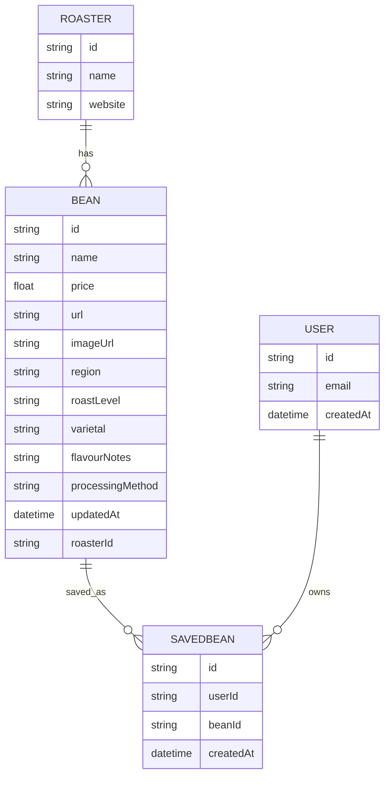
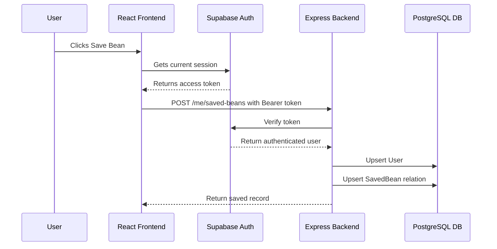
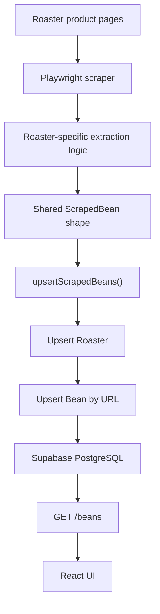
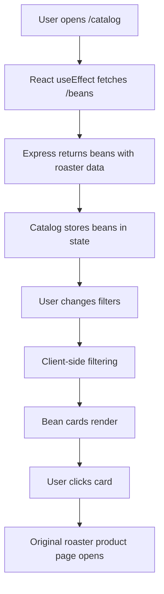
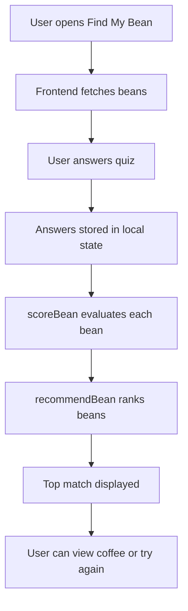

# BrewStack

**Singapore's specialty coffee, in one place.**

BrewStack is a full-stack coffee discovery platform built for Singapore's specialty coffee scene. It aggregates live bean offerings from local roasters, normalises the information into one catalogue, and gives users multiple ways to discover what to drink next: browsing, filtering, map-based roaster discovery, a guided recommendation quiz, and saved beans for logged-in users.

The motivation behind BrewStack is simple: specialty coffee changes quickly. Roasters rotate beans, introduce limited drops, remove sold-out coffees, and publish tasting information in different formats across their own websites. For a newcomer, this makes discovery confusing. For a more experienced coffee drinker, it creates a lot of tab-switching. BrewStack centralises that information into one interface so users can compare beans across roasters without needing to visit every site manually.


---

## Table of Contents

1. [Project Overview](#project-overview)
2. [Problem Statement](#problem-statement)
3. [Current Milestone 2 Scope](#current-milestone-2-scope)
4. [Core Features](#core-features)
5. [System Design](#system-design)
6. [Frontend Architecture](#frontend-architecture)
7. [Backend Architecture](#backend-architecture)
8. [Scraper Architecture](#scraper-architecture)
9. [Database Design](#database-design)
10. [Authentication and Saved Beans](#authentication-and-saved-beans)
11. [API Reference](#api-reference)
12. [Data Flow](#data-flow)
13. [Deployment Design](#deployment-design)
14. [Local Setup](#local-setup)
15. [Feature Specifications](#feature-specifications)
16. [Design Decisions](#design-decisions)
17. [Known Limitations](#known-limitations)
18. [Future Improvements](#future-improvements)
19. [Milestone 2 Progress Summary](#milestone-2-progress-summary)
20. [Contributors](#contributors)

---

## Project Overview

BrewStack is a React, TypeScript, Express, PostgreSQL, Prisma, Supabase, and Playwright application. It has three main layers:

| Layer | Responsibility |
|---|---|
| Frontend | Presents the catalogue, roaster map, recommendation quiz, login page, and saved beans UI |
| Backend | Serves API routes, verifies authenticated requests, runs scheduled scrapers, and writes data to the database |
| Database | Stores roasters, beans, users, and saved-bean relationships |

The product currently focuses on Singapore-based specialty coffee roasters. The app tracks beans from multiple roasters and stores details such as:

- Bean name
- Roaster
- Price
- Product URL
- Product image
- Region or origin
- Roast level or recommended brew style
- Varietal
- Tasting notes
- Processing method
- Last updated time

The current implementation supports:

- HomeGround
- Nylon
- Tiong Hoe
- Alchemist
- The Community Coffee

The frontend lets users browse these beans through a catalogue, use filters, click through to the original roaster product page, explore roaster locations on a map, take a quiz to get one recommended bean, log in through Supabase Auth, and save beans for later.

---

## Problem Statement

Singapore has a strong and growing specialty coffee scene, but information about available beans is fragmented. Each roaster maintains its own website, product format, tasting note style, and update frequency. A coffee drinker who wants to compare options usually has to open many roaster sites one by one.

This creates several problems:

### 1. Coffee discovery is scattered

Coffee information lives across roaster websites, Instagram pages, newsletters, and cafe menus. A user cannot easily compare a Nylon coffee against a HomeGround coffee or Tiong Hoe coffee without visiting each roaster separately.

### 2. Drops rotate quickly

Many specialty beans are seasonal or limited. A bean that is available this week may disappear shortly after. Static lists become outdated quickly, so a useful catalogue needs to refresh frequently.

### 3. Coffee metadata is inconsistent

Different roasters describe coffee in different ways. One roaster may list varietal, process, and tasting notes in a structured table. Another may put them inside a paragraph. Another may use the recommended brew method instead of a strict roast level. BrewStack has to normalise these differences into one schema.

### 4. New drinkers need guidance

Someone who is new to specialty coffee may not know whether they prefer washed, natural, fruity, nutty, filter, espresso, light roast, or medium roast. A raw catalogue is useful, but a guided quiz makes discovery more approachable.

### 5. Returning users need memory

Users may find beans they want to revisit, compare, or buy later. Without accounts and saved beans, discovery ends once the browser session ends. BrewStack's saved beans feature gives users a simple personal list.

---

## Current Milestone 2 Scope

Milestone 1 focused on proving that the data pipeline could work: scrape roaster sites, store beans in Supabase PostgreSQL, expose them through an Express API, and render a catalogue in React.

Milestone 2 expands that proof of concept into a more complete discovery product. The current repository includes:

- A redesigned landing page
- A live bean catalogue
- Filter controls for catalogue discovery
- Product cards that link to real roaster product pages
- A fresh drops preview
- Popular tasting note summary
- A roaster map with Singapore locations
- Postal-code search on the map
- Colour-coded roaster markers
- A guided Find My Bean quiz
- Recommendation scoring logic
- Supabase Auth login and signup
- Navbar login/logout state
- Saved beans backend model and routes
- Saved beans frontend page
- Scheduled scraper registration
- Scrapers for five supported roasters
- Railway-oriented backend deployment configuration
- Vercel frontend routing configuration

The scope is intentionally focused. BrewStack is not trying to replace roaster websites or handle checkout directly. Instead, the app acts as a discovery layer that helps users decide what they want, then sends them to the roaster's real product page.

---

## Core Features

### 1. Bean Catalog

The Bean Catalog is the main browsing surface. It fetches bean data from the backend, stores it in React state, and renders each bean as a card.

Each card displays:

- Bean image
- Bean name
- Roaster name
- Price
- Region or origin
- Roast level or brew style
- Processing method
- Varietal
- Tasting note pills
- Save Bean button
- Updated recently indicator

The card itself links to the bean's original product page in a new browser tab. This keeps BrewStack focused on discovery while preserving the roaster's own checkout flow.

Catalogue filters currently include:

- Roaster
- Origin
- Roast level
- Process

The page also contains a sidebar with:

- Fresh Drops
- Popular Notes
- Roasters to Follow


### 2. Home Page

The Home page introduces BrewStack as a discovery platform. It gives users a clear entry point into the core workflows:

- Find my coffee
- Browse catalog
- Explore roasters
- View fresh drops

The landing page also explains why the product exists:

- Coffee information is scattered
- Coffee drops become outdated quickly
- Smaller roasters are easy to miss

The page fetches beans from the backend and shows the first few as "This Week's Fresh Drops". These cards link directly to roaster product pages.

### 3. Roaster Map

The Roasters page contains an interactive Leaflet map through `react-leaflet`.

The map currently uses a hardcoded list of Singapore roaster branches. Each marker includes:

- Roaster name
- Branch name
- Address
- Latitude and longitude
- Roaster-specific marker colour

Supported map roaster groups include:

- Homeground Coffee Roasters
- Nylon Coffee
- Tiong Hoe Specialty Coffee
- Alchemist Coffee
- The Community Coffee

The map also includes postal-code lookup using Singapore's OneMap API. When a user enters a postal code, BrewStack fetches the postal-code location and recenters the map around it.

This feature is useful for users who want to discover roasters near them or plan where to buy coffee physically.

### 4. Find My Bean

Find My Bean is a guided quiz that recommends one coffee based on user preferences.

The quiz asks five questions:

1. What do you usually brew?
2. What kind of flavours sound good to you?
3. How adventurous are you with trying new coffees?
4. What kind of cup do you prefer?
5. What are you looking for today?

The scoring function checks bean fields such as:

- Tasting notes
- Roast level
- Processing method
- Varietal
- Region

It then awards points based on matching keywords. For example:

- Fruity preferences match notes like berry, grape, plum, cherry, citrus, peach, apple, and pear
- Chocolatey preferences match chocolate, cacao, cocoa, mocha, and brownie
- Floral preferences match jasmine, lavender, rose, and bergamot
- Nutty preferences match almond, hazelnut, peanut, and walnut
- Adventurous preferences match natural, anaerobic, honey, fermented, macerated, or experimental coffees

The result page displays:

- Recommended bean image
- Roaster
- Bean name
- Tasting note pills
- Origin
- Process
- Varietal
- Brew style
- Price
- Reasons for the match
- View Coffee button
- Try Again button

This feature makes the catalogue more accessible to users who are not yet comfortable reading coffee metadata.

### 5. Login and Authentication

BrewStack uses Supabase Auth for user authentication.

The frontend creates a Supabase client using:

- `VITE_SUPABASE_URL`
- `VITE_SUPABASE_ANON_KEY`

The login page allows users to:

- Create an account
- Log in with email and password

The navbar listens for Supabase auth state changes. If a user is logged in, the navbar shows a Logout button. If no user is logged in, it shows a Login link.

Passwords are not stored directly in the BrewStack application database. Authentication is delegated to Supabase Auth.

### 6. Saved Beans

Saved Beans lets logged-in users store coffees they want to revisit or buy later.

The flow is:

1. User logs in with Supabase Auth
2. User clicks Save Bean on a catalog card
3. Frontend retrieves the Supabase access token
4. Frontend sends a `POST /me/saved-beans` request with the token
5. Backend verifies the token with Supabase
6. Backend upserts the user into the local `User` table
7. Backend creates a `SavedBean` row linking the user and bean
8. User can view saved beans on `/saved-beans`
9. User can remove a bean with Unsave

Saved bean cards display the same core information as catalogue cards, with additional actions:

- View Coffee
- Unsave

This is the first step toward personalisation. Future recommendation logic may use saved beans to infer preferences.

---

## System Design

BrewStack follows a three-layer web architecture:

1. React frontend hosted on Vercel
2. Express backend hosted on Railway
3. PostgreSQL database hosted through Supabase

Playwright scrapers run inside the backend service. The scraper writes normalised data to the database through Prisma. The frontend never scrapes sites directly; it only reads from the backend API.

  User["User"] --> Frontend["React + TypeScript Frontend"]
  Frontend --> API["Express API"]
  API --> Prisma["Prisma ORM"]
  Prisma --> DB["Supabase PostgreSQL"]
  API --> Auth["Supabase Auth"]
  Scheduler["node-cron Scheduler"] --> Scrapers["Playwright Scrapers"]
  Scrapers --> RoasterSites["Roaster Websites"]
  Scrapers --> API
  API --> SSE["Server-Sent Events"]
  SSE --> Frontend


### Main system responsibilities

| Component | Responsibility |
|---|---|
| React frontend | User interface, routing, catalogue filtering, quiz, saved beans display |
| Express backend | API routes, scraper execution, auth verification, database access |
| Prisma ORM | Type-safe database access and schema modelling |
| Supabase PostgreSQL | Persistent storage for roasters, beans, users, saved beans |
| Supabase Auth | Account creation, login, session tokens |
| Playwright | Browser automation for scraping roaster websites |
| node-cron | Schedules recurring scraper runs |
| Railway | Backend hosting |
| Vercel | Frontend hosting |
| Leaflet | Interactive map rendering |
| OneMap API | Postal-code geocoding for Singapore map search |

---

## Frontend Architecture

The frontend is located in:

```text
client/
```

It is a Vite React application written in TypeScript.

### Frontend routes

Routes are defined in `client/src/App.tsx`.

| Path | Page | Purpose |
|---|---|---|
| `/` | `Home.tsx` | Landing page and product introduction |
| `/catalog` | `Catalog.tsx` | Main bean catalogue |
| `/roasters` | `Roasters.tsx` | Interactive roaster map |
| `/find-my-coffee` | `FindMyCoffee.tsx` | Guided recommendation quiz |
| `/login` | `Login.tsx` | Login and signup page |
| `/saved-beans` | `SavedBeans.tsx` | User's saved coffees |

### Shared navigation

`NavBar.tsx` is used across pages. It provides consistent navigation between:

- Home
- Catalog
- Roasters
- Find My Coffee
- Saved Beans

It also displays login state through Supabase Auth. This means users can move between discovery, saving, and browsing without learning different page layouts.

### Data fetching

The frontend uses `fetch()` to call the backend API. The backend URL is read from:

```text
VITE_API_URL
```

The key endpoint used by most pages is:

```text
GET /beans
```

Catalog, Home, and Find My Bean all depend on the bean catalogue.

### Catalogue state and filtering

`Catalog.tsx` stores all beans in local React state:

```text
beans
```

It also stores selected filters:

```text
roaster
origin
roastLevel
process
```

Filtering is done client-side. This is simple and works well at the current data scale. If the catalogue grows significantly, filtering could be moved to the backend with query parameters.

### Real-time update mechanism

The catalogue subscribes to the backend `/events` route using `EventSource`.

When the backend finishes a scraper run, it calls `notifyClients()`. Connected clients receive an update event and can re-fetch beans.

This prevents users from needing to manually refresh the page after a scrape run.

### UI design direction

The current UI uses a warm editorial coffee style:

- Off-white background
- Serif headings
- Thin borders
- Simple cards
- Small meta labels
- Soft badge pills
- Dark primary buttons

This visual style keeps the app closer to a coffee catalogue/editorial tool rather than a generic ecommerce dashboard.

---

## Backend Architecture

The backend is located in:

```text
src/
index.ts
```

The entry point is `index.ts`, which:

1. Creates the Express app
2. Enables JSON body parsing
3. Enables CORS for the frontend
4. Registers API routes
5. Registers the scraper cron job
6. Starts the server

### Backend responsibilities

The backend is responsible for:

- Serving bean and roaster data
- Running scraper jobs
- Writing scraped beans to the database
- Verifying Supabase Auth tokens
- Managing saved beans
- Notifying frontend clients after scrape updates

### Important backend files

| File | Purpose |
|---|---|
| `index.ts` | Express app setup and server entry |
| `src/routes/index.ts` | API routes |
| `src/db/client.ts` | Prisma client |
| `src/db/upsert.ts` | Roaster and bean upsert logic |
| `src/auth/supabase.ts` | Backend Supabase client |
| `src/auth/getUser.ts` | Reads and verifies Bearer tokens |
| `src/scraper/scheduler.ts` | Registers scheduled scraper runs |
| `src/scraper/scrapers/` | Roaster-specific scraper classes |

### Express route registration

All API routes are attached through:

```text
app.use(routes)
```

This keeps the server entry point small and places API logic in `src/routes/index.ts`.

---

## Scraper Architecture

BrewStack's scraper system is built around a shared base class and roaster-specific subclasses.

```text
src/scraper/scrapers/BaseScraper.ts
```

The base scraper defines:

- The roaster attached to a scraper
- The required `scrape()` method
- A `run()` wrapper that catches errors and returns a structured result
- A `toScraped()` method that converts internal `Bean` objects into plain scraped data
- `openCatalogPage()` for launching a Playwright Chromium browser

Each roaster scraper implements its own `scrape()` method because each roaster website has different HTML and data structures.

### Supported scrapers

| Scraper | Roaster | Notes |
|---|---|---|
| `HomegroundScraper.ts` | HomeGround | Uses product handles and Shopify `.js` endpoints |
| `NylonScraper.ts` | Nylon | Uses product pages and feature chart values |
| `TiongHoeScraper.ts` | Tiong Hoe | Uses Shopify product JSON and product page HTML parsing |
| `AlchemistScraper.ts` | Alchemist | Extracts card data and product detail fields |
| `CommunityCoffeeScraper.ts` | The Community Coffee | Uses Shopify product JSON and description field parsing |

### Scraper output shape

Every scraper eventually returns data matching this shape:

```ts
type ScrapedBean = {
  roasterName: string;
  website: string;
  beanName: string;
  price?: number;
  url?: string;
  imageUrl?: string;
  region?: string;
  roastLevel?: string;
  varietal?: string;
  flavourNotes?: string;
  processingMethod?: string;
};
```

This shared output shape is important because the database upsert logic does not need to care which roaster produced the bean.

### Scheduled scraping

The scheduled scraper list is centralised in:

```text
src/scraper/scheduler.ts
```

The scheduler creates scraper instances for all currently supported roasters and runs them in sequence.

The scraper run flow is:

1. Clear existing bean data
2. Run each scraper
3. Log how many beans each scraper found
4. Upsert each scraper's beans into the database
5. Notify connected frontend clients through server-sent events

This design keeps the catalogue fresh while avoiding duplicate records.

### Manual scraper routes

The backend also contains manual scraper routes for development and testing:

- `POST /scrape/homeground`
- `POST /scrape/tionghoe`
- `POST /scrape/nylon`

These routes allow selected scrapers to be triggered manually without waiting for the scheduled job.

---

## Database Design

BrewStack uses PostgreSQL through Supabase, with Prisma as the ORM.

The Prisma schema is located at:

```text
prisma/schema.prisma
```

### Current models

The database currently has four main application models:

1. `Roaster`
2. `Bean`
3. `User`
4. `SavedBean`



### Roaster model

`Roaster` stores the roaster name and website.

```prisma
model Roaster {
  id      String @id @default(cuid())
  name    String @unique
  website String

  beans Bean[]
}
```

The roaster name is unique because it is used as the upsert key. If a scraper finds a bean from an existing roaster, Prisma updates the existing roaster instead of creating a duplicate.

### Bean model

`Bean` stores the scraped coffee product details.

```prisma
model Bean {
  id               String   @id @default(cuid())
  name             String
  price            Float?
  url              String?  @unique
  imageUrl         String?
  region           String?
  roastLevel       String?
  varietal         String?
  flavourNotes     String?
  processingMethod String?
  updatedAt        DateTime @updatedAt

  roasterId String
  roaster   Roaster @relation(fields: [roasterId], references: [id])

  savedBy SavedBean[]
}
```

The product URL is unique because it is the most stable identifier for a bean across scraper runs. Bean names can change slightly or repeat across roasters, but product URLs are more reliable.

Most fields are nullable because roasters do not publish data consistently. For example, one roaster may not include varietal, while another may not have a clear processing method. Optional fields prevent the scraper from failing when a field is absent.

### User model

`User` stores the application's local copy of an authenticated Supabase user.

```prisma
model User {
  id        String   @id
  email     String?  @unique
  createdAt DateTime @default(now())

  savedBeans SavedBean[]
}
```

The `id` comes from Supabase Auth. BrewStack does not store passwords in this table.

### SavedBean model

`SavedBean` links users to beans.

```prisma
model SavedBean {
  id        String   @id @default(cuid())
  userId    String
  beanId    String
  createdAt DateTime @default(now())

  user User @relation(fields: [userId], references: [id])
  bean Bean @relation(fields: [beanId], references: [id])

  @@unique([userId, beanId])
}
```

The unique constraint on `[userId, beanId]` prevents a user from saving the same bean multiple times.

---

## Authentication and Saved Beans

Authentication is handled by Supabase Auth.

### Frontend auth flow

The frontend creates a Supabase client in:

```text
client/src/lib/supabase.ts
```

It reads:

```text
VITE_SUPABASE_URL
VITE_SUPABASE_ANON_KEY
```

The Login page calls:

- `supabase.auth.signUp()`
- `supabase.auth.signInWithPassword()`

The navbar calls:

- `supabase.auth.getSession()`
- `supabase.auth.onAuthStateChange()`
- `supabase.auth.signOut()`

This lets the UI show login/logout state without requiring a custom session system.

### Backend auth verification

For protected routes, the frontend sends:

```text
Authorization: Bearer <supabase_access_token>
```

The backend verifies the token in:

```text
src/auth/getUser.ts
```

It uses Supabase Auth's `getUser()` method to confirm the token belongs to a real logged-in user.

### Saved bean creation flow



### Saved beans retrieval flow

When the user visits `/saved-beans`, the frontend:

1. Gets the Supabase session
2. Sends the access token to `GET /me/saved-beans`
3. Backend verifies the user
4. Backend loads saved beans and nested roaster data
5. Frontend renders saved bean cards

If the user is not logged in, the page shows a message asking them to log in.

---

## API Reference

### Health check

```http
GET /health
```

Returns:

```json
{
  "ok": true
}
```

Purpose:

- Confirms that the backend service is running
- Useful for debugging deployment

### Get all beans

```http
GET /beans
```

Returns all beans with their roaster included.

Used by:

- Home page
- Catalog page
- Find My Bean page

### Get all roasters

```http
GET /roasters
```

Returns all roasters with their beans included.


### Get saved beans

```http
GET /me/saved-beans
Authorization: Bearer <token>
```

Returns all beans saved by the authenticated user.

Requires:

- Supabase access token

### Save a bean

```http
POST /me/saved-beans
Authorization: Bearer <token>
Content-Type: application/json

{
  "beanId": "bean_id_here"
}
```

Creates a saved-bean relationship between the current user and a bean.

### Unsave a bean

```http
DELETE /me/saved-beans/:beanId
Authorization: Bearer <token>
```

Removes a bean from the current user's saved list.

### Manual scraper routes

```http
POST /scrape/homeground
POST /scrape/tionghoe
POST /scrape/nylon
```

These are development/testing routes for manually triggering selected scrapers.

---

## Data Flow

### Scraped bean ingestion



### Catalogue browsing



### Recommendation flow



---

## Deployment Design

BrewStack is designed for split deployment:

- Frontend on Vercel
- Backend on Railway
- Database and auth on Supabase

### Frontend deployment

The frontend is in:

```text
client/
```

Vercel serves the React app as a static frontend. The `client/vercel.json` file rewrites all routes to `index.html`, which is required for React Router paths like:

```text
/catalog
/roasters
/find-my-coffee
/saved-beans
```

Without this rewrite, refreshing on a nested route may cause a 404.


### Production environment variables

Backend environment variables:

```text
DATABASE_URL=
SUPABASE_URL=
SUPABASE_ANON_KEY=
PORT=
```

Frontend environment variables:

```text
VITE_API_URL=
VITE_SUPABASE_URL=
VITE_SUPABASE_ANON_KEY=
```

The frontend must point `VITE_API_URL` to the deployed Railway backend URL.

---

## Local Setup

### Prerequisites

- Node.js
- npm
- Supabase project
- PostgreSQL connection string from Supabase
- Chromium dependencies for Playwright

### Clone the repository

```bash
git clone https://github.com/edwardheww/BrewStack.git
cd BrewStack
```

### Install backend dependencies

```bash
npm install
```

### Install frontend dependencies

```bash
cd client
npm install
cd ..
```

### Root environment variables

Create a `.env` file in the project root:

```env
DATABASE_URL="your_supabase_postgres_connection_string"
SUPABASE_URL="your_supabase_project_url"
SUPABASE_ANON_KEY="your_supabase_publishable_or_anon_key"
PORT=3000
```

### Frontend environment variables

Create a `.env` file inside `client/`:

```env
VITE_API_URL=http://localhost:3000
VITE_SUPABASE_URL="your_supabase_project_url"
VITE_SUPABASE_ANON_KEY="your_supabase_publishable_or_anon_key"
```

### Generate Prisma client

```bash
npx prisma generate
```

### Run backend

```bash
npm run dev
```

Backend runs at:

```text
http://localhost:3000
```

### Run frontend

```bash
cd client
npm run dev
```

Frontend runs at:

```text
http://localhost:5173
```

---

## Feature Specifications

This section documents the current product features in a more formal specification style.

### Feature 1: Bean Catalog

#### Goal

Allow users to browse all currently scraped coffees from supported Singapore roasters.

#### Target users

- New coffee drinkers comparing options
- Experienced drinkers looking for current drops
- Users who want to buy directly from roasters

#### Inputs

- Bean data from `GET /beans`
- User-selected filters

#### Outputs

- Filtered bean cards
- Product-page links
- Save Bean action

#### Current behaviour

The catalogue fetches all beans once on page load and stores them in React state. Filters are applied client-side. Each bean card opens the original roaster product URL in a new tab.

#### Data shown

- Name
- Roaster
- Price
- Origin
- Roast
- Process
- Varietal
- Tasting notes
- Image

#### Error handling

If the backend fetch fails, the error is logged in the browser console.

#### Future improvement

The catalogue can be improved with:

- Backend query filtering
- Search by bean name
- Sort by price or freshness
- Better empty states
- Loading skeletons

### Feature 2: Fresh Drops

#### Goal

Highlight recent or currently visible beans from the catalogue.

#### Current behaviour

The Home page and Catalog sidebar use the first few beans from the backend response as fresh drops.

#### Current limitation

Freshness is currently based on ordering rather than a dedicated drop date. The database has `updatedAt`, which could later power a more accurate "latest drops" sort.

### Feature 3: Find My Bean

#### Goal

Recommend one coffee based on user preferences.

#### Target users

- Users who do not know how to interpret coffee metadata
- Users who want a quick suggestion instead of browsing many beans

#### Questions

The quiz asks about:

- Brew method
- Flavour preference
- Adventure level
- Cup profile
- Purchase intent

#### Scoring method

The system uses keyword matching. It combines bean text fields into one searchable string, then checks whether answer-specific keywords appear in the bean's metadata.

For example:

- Filter coffee adds points to beans with `filter` or `light`
- Espresso adds points to beans with `espresso`, `medium`, or `dark`
- Fruity adds points to beans with fruit-related tasting notes
- Adventurous adds points to natural, anaerobic, fermented, or experimental coffees

#### Output

The result page shows:

- Matched bean
- Why it matched
- Price
- Tasting notes
- Bean metadata
- View Coffee link
- Try Again button

#### Future improvement

The scoring can later be improved with weighted preferences, saved-bean history, and natural-language explanations.

### Feature 4: Roaster Map

#### Goal

Help users find specialty coffee roasters and branches around Singapore.

#### Current behaviour

The map uses Leaflet with Carto map tiles. Roasters are shown as colour-coded markers. Users can enter a postal code to recenter the map.

#### Data source

Roaster branches are currently hardcoded in the frontend component.

#### External dependency

Postal-code lookup uses:

```text
https://www.onemap.gov.sg/api/common/elastic/search
```

#### Future improvement

Roaster branch data can be moved into the database, allowing admins or scrapers to update it without editing frontend code.

### Feature 5: Login and Signup

#### Goal

Allow users to create accounts and log in so personal features can persist.

#### Current behaviour

Users enter email and password. Supabase handles account creation and authentication.

#### Output

After login, the user is redirected to the catalogue.

#### Navbar integration

The navbar reflects auth state:

- Logged out: Login link
- Logged in: Logout button

### Feature 6: Saved Beans

#### Goal

Allow logged-in users to save beans and view them later.

#### Current behaviour

From the catalogue, logged-in users can save a bean. If they are not logged in, the app redirects them to the login page.

The saved beans page fetches the user's saved beans from the backend and renders them as cards.

#### Saved bean actions

- View Coffee
- Unsave

#### Backend protection

Saved bean routes require a Supabase Bearer token.

#### Future improvement

Saved beans can support:

- Notes by the user
- Tried / want to try status
- Ratings
- Personalised recommendations

---

## Design Decisions

### Why scrape instead of requiring manual input?

The product aims to stay updated as roasters rotate their offerings. Manual input would be too slow and error-prone. Scraping lets BrewStack refresh the catalogue automatically and remain useful even when roasters update often.

### Why keep direct roaster links?

BrewStack is a discovery layer, not a checkout platform. Direct links respect the roaster's existing store, payment flow, and inventory system. This also reduces scope and avoids ecommerce complexity.

### Why use Prisma?

Prisma provides a typed schema and a clean way to model relationships between roasters, beans, users, and saved beans. It also makes upsert logic straightforward.

### Why Supabase?

Supabase provides both PostgreSQL and Auth, which fits BrewStack's needs:

- Hosted database
- User authentication
- Access tokens for protected routes
- Works with Prisma

### Why use client-side filtering first?

The current catalogue size is manageable. Client-side filtering is simpler to build and gives instant UI feedback. Backend filtering can be added later if data volume grows.

### Why use keyword-based recommendation?

For Milestone 2, keyword scoring is transparent and easy to debug. It allows the team to explain why a bean was selected. A more advanced model can be added later, but the current approach is predictable and aligned with the database fields.

---

## Known Limitations

### 1. Roaster websites can change

Scrapers depend on roaster site structure. If a roaster changes class names, product JSON shape, or page layout, that scraper may need to be updated.

### 2. Data is not equally complete across roasters

Some roasters publish detailed metadata. Others provide fewer fields. BrewStack handles this by allowing nullable fields, but users may see `N/A` for missing values.

### 3. Map roaster locations are hardcoded

The map currently uses a static list of branches. This is reliable for Milestone 2, but it is not yet connected to the database.

### 4. Recommendation logic is rule-based

Find My Bean uses keyword scoring. It works for clear cases but may miss nuanced flavour relationships or personal preferences.

### 5. Saved beans depend on current bean records

Saved beans reference current `Bean` records. If a bean is removed from the catalogue during a refresh, the saved relationship may no longer behave like a long-term historical archive. A future design could preserve unavailable beans separately.


---

## Future Improvements

### Better search and sorting

Add:

- Text search
- Sort by price
- Sort by recently updated
- Sort by roaster
- Sort by process
- Sort by tasting note similarity

### More roasters

The base scraper pattern makes it possible to add more roasters by implementing new scraper classes.

Potential future roasters can be added by:

1. Creating a new scraper class
2. Returning the shared `ScrapedBean` shape
3. Registering it in `scheduler.ts`
4. Testing with manual or scheduled runs

### Better recommendation system

The quiz can become more personal by using:

- Saved beans
- User ratings
- Previously viewed beans
- Price preference
- Roast preference
- Process preference

### Availability and history

Instead of deleting unavailable beans completely, BrewStack could mark them as unavailable. This would allow:

- Historical saved beans
- Drop archive
- Restock tracking
- Trends over time

### Admin dashboard

An admin view could allow maintainers to:

- Trigger scrapers
- View scraper errors
- Inspect missing fields
- Disable broken beans
- Add roaster branch locations

### More user features

Potential account features:

- Favourite roasters
- Tried beans
- Private notes
- Personal ratings
- Recommendation history

---

## Milestone 2 Progress Summary

During Milestone 2, BrewStack moved from a basic data pipeline and catalogue into a fuller discovery product.

Completed work includes:

- Planned MS2 scope, feature structure, implementation priorities, and workload distribution
- Improved scraper pipeline reliability
- Fixed Tiong Hoe scraper extraction issues
- Implemented Alchemist scraper
- Implemented Community Coffee scraper
- Expanded supported roasters to five
- Refined backend deployment configuration
- Added scheduled scraper registration
- Added server-sent event refresh support
- Built Find My Coffee page, route, quiz logic, result UI, and scoring system
- Updated Find My Coffee design
- Built Home page route, hero, buttons, feature sections, fresh drops, and CTA
- Updated catalogue cards to open real roaster product pages
- Created a shared navigation bar across pages
- Built Roasters page with interactive map
- Added roaster branch markers and colour-coded legend
- Added postal-code search for map recentering
- Set up Supabase authentication
- Added login and signup UI
- Connected navbar to auth state
- Added saved beans database model
- Added saved beans backend routes
- Built Saved Beans frontend page
- Connected saved bean actions to authenticated backend requests

---

## Repository Structure

```text
BrewStack/
├── api/
│   └── index.ts
├── client/
│   ├── public/
│   ├── src/
│   │   ├── components/
│   │   │   ├── NavBar.tsx
│   │   │   └── RoasterMap.tsx
│   │   ├── lib/
│   │   │   └── supabase.ts
│   │   ├── pages/
│   │   │   ├── Catalog.tsx
│   │   │   ├── FindMyCoffee.tsx
│   │   │   ├── Home.tsx
│   │   │   ├── Login.tsx
│   │   │   ├── Roasters.tsx
│   │   │   └── SavedBeans.tsx
│   │   ├── types/
│   │   │   └── index.ts
│   │   ├── App.tsx
│   │   ├── index.css
│   │   └── main.tsx
│   ├── package.json
│   └── vercel.json
├── prisma/
│   ├── migrations/
│   └── schema.prisma
├── src/
│   ├── auth/
│   │   ├── getUser.ts
│   │   └── supabase.ts
│   ├── db/
│   │   ├── client.ts
│   │   └── upsert.ts
│   ├── routes/
│   │   └── index.ts
│   └── scraper/
│       ├── scheduler.ts
│       ├── scrapers/
│       │   ├── AlchemistScraper.ts
│       │   ├── BaseScraper.ts
│       │   ├── CommunityCoffeeScraper.ts
│       │   ├── HomegroundScraper.ts
│       │   ├── NylonScraper.ts
│       │   └── TiongHoeScraper.ts
│       └── types/
│           └── index.ts
├── Dockerfile
├── index.ts
├── package.json
├── prisma.config.ts
└── README.md
```

---

## Tech Stack

| Area | Technology |
|---|---|
| Frontend framework | React |
| Frontend language | TypeScript |
| Frontend build tool | Vite |
| Routing | React Router |
| Map UI | Leaflet and React Leaflet |
| Backend framework | Express |
| Backend language | TypeScript |
| Database | PostgreSQL |
| Database host | Supabase |
| ORM | Prisma |
| Authentication | Supabase Auth |
| Scraping | Playwright |
| Scheduling | node-cron |
| Backend deployment | Railway |
| Frontend deployment | Vercel |
| Styling | CSS |

---

## Contributors

- Lim Jun Hong
- Edward Hew

Repository:

```text
https://github.com/edwardheww/BrewStack
```

---

## Summary

BrewStack is a centralised discovery platform for Singapore specialty coffee. It combines automated scraping, a normalised bean database, a catalogue frontend, an interactive roaster map, a recommendation quiz, authentication, and saved beans.

The current implementation demonstrates a complete end-to-end product loop:

1. Scrapers collect roaster product data
2. Backend normalises and stores beans
3. Frontend displays current beans
4. Users discover beans through browsing, mapping, or recommendation
5. Users can save beans after logging in
6. Users can return later and open saved beans directly on the roaster's website

This makes BrewStack more than a static catalogue. It is a living discovery layer for local coffee, designed to help new drinkers start with less confusion and help seasoned drinkers keep up with rotating specialty drops.
